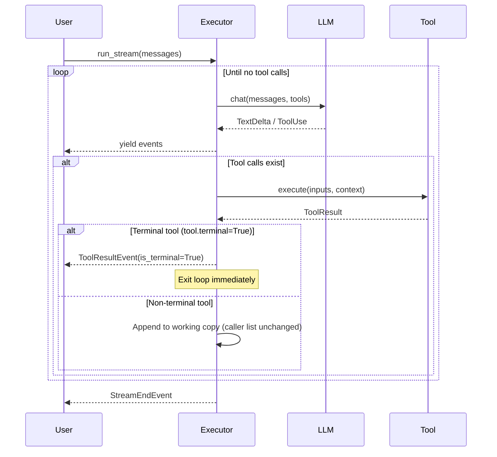

# AgentExecutor

`AgentExecutor` manages the agentic loop: send messages → LLM responds with tool calls → execute tools → repeat until done.

## Basic Usage

```python
from dobby import AgentExecutor, OpenAIProvider, Tool

executor = AgentExecutor(
    provider="openai",
    llm=OpenAIProvider(model="gpt-4o"),
    tools=[MyTool()],
)

async for event in executor.run_stream(messages, system_prompt="You are helpful."):
    match event.type:
        case "text-delta":
            print(event.delta, end="")
        case "tool-use":
            print(f"\n[Tool: {event.name}]")
```

---

## Initialization

```python
from dobby.context import ContextPolicy

executor = AgentExecutor(
    provider="openai",           # "openai" | "azure-openai" | "anthropic"
    llm=provider,                # Provider instance
    tools=[Tool1(), Tool2()],    # Optional tools
    output_type=MyOutputModel,   # Optional structured output
    output_mode="tool",          # "tool" | "native"
    context_policy=ContextPolicy(mode="trim"),  # Optional; default None = no compaction
)
```

| Parameter | Type | Description |
|-----------|------|-------------|
| `provider` | `str` | Provider name for schema formatting |
| `llm` | `OpenAIProvider` | LLM provider instance |
| `tools` | `list[Tool]` | Available tools |
| `output_type` | `type[BaseModel]` | Pydantic model for structured output |
| `output_mode` | `str` | How to get structured output |
| `context_policy` | `ContextPolicy \| None` | Opt-in compaction config. `None` (default) disables compaction entirely. |

### Accessing Registered Tools

```python
# Get all tools as dict[name, Tool]
executor.tools

# Get tool names
list(executor.tools.keys())  # ['search', 'fetch_data', ...]

# Get a specific tool
executor.tools['search']
```

---

## run_stream()

```python
async for event in executor.run_stream(
    messages,                    # Conversation history
    system_prompt="...",         # Optional system prompt
    context=my_context,          # Passed to Injected[T] tools
    max_iterations=10,           # Max tool call loops
    reasoning_effort="medium",   # For o1/o3 models
    approved_tool_calls=set(),   # Pre-approved tool call IDs
    max_model_corrections=3,     # Run-wide model-correction budget
):
    ...
```

`max_model_corrections` is a single run-wide budget (default `3`) shared by tool-call correction and final-result correction. When it is exhausted, `run_stream()` raises `ModelRetryExhaustedError`.

Tool errors in `ToolResultEvent.result` and conversation history are classified strings of the form `[error_code] message`, not `{"error": ...}`. Host-side `error_details` (`ToolErrorDetails`) still holds exception diagnostics, including the **full exception traceback**. Do not send `error_details` (especially `traceback`) to untrusted clients such as browsers.

Approval is host control flow, not a classified model error. The executor still emits a `ToolResultEvent` with `is_error=True` and `result={"approval_required": True}` so history does not look like the tool succeeded, then re-raises `ApprovalRequired`. Remaining unexecuted calls in that batch get the same placeholder dict. Already-running parallel calls may still complete successfully.

Host cancellation re-raises `asyncio.CancelledError` and does not yield `{"cancelled": True}` placeholders. A single in-flight call, a streaming or terminal call, and a parallel `asyncio.gather` batch surface that error from the in-flight read: parallel cancellation escapes `gather` before any per-call placeholders are assembled. In a sequential multi-tool batch, earlier successful events may already have been yielded before a later call is cancelled, so stopping consumption after one of those earlier events can prevent the later cancellation from being observed.

`dobby.exceptions` also exports the classification helpers the executor uses: `classify_tool_error`, `format_model_error`, and `ErrorDecision`. `classify_tool_error(exception)` returns an `ErrorDecision` (`code`, `model_message`, `retry_model`) or `None` for approval, cancellation, and other non-error control flow. `format_model_error(decision)` produces the `[error_code] message` string sent to the model.

---

## Event Types

The executor yields all provider events plus tool events:

| Event | Description |
|-------|-------------|
| `StreamStartEvent` | Stream started |
| `TextDeltaEvent` | Text chunk |
| `ReasoningDeltaEvent` | Reasoning chunk |
| `ToolUseEvent` | Tool call from LLM |
| `ToolStreamEvent` | Progress from streaming tool |
| `ToolResultEvent` | Tool execution result (check `is_terminal` for terminal tools) |
| `ToolUseEndEvent` | Tool finished |
| `ContextEditEvent` | Context compaction applied (trim or summarize). See `applied_edits` for counts, optional `summary_text`, and audit stash. |
| `StreamEndEvent` | Stream/iteration finished |

> For terminal tools that exit the loop, see [Terminal Tools](./tools/creating-tools.md#terminal-tools).

---

## Context compaction (opt-in)

Compaction is **off by default**. Pass `context_policy=ContextPolicy(...)` to enable it. The list you pass to `run_stream(messages, ...)` is **never mutated**; the executor copies it once per run and appends tool round-trips to that working copy only.

### When automatic compaction runs

Automatic compaction runs **between completed agent turns**: after tool results for the current batch are on the working list and **before** the next model call. It does not run mid-stream.

The trigger uses the previous turn's reported input tokens (from `StreamEndEvent.usage`, or a one-time character estimate when usage is missing) combined with a live estimate of the outgoing message list so large tool results appended after that turn still count. Compaction fires when that combined basis reaches `ContextPolicy.trigger_tokens` (`ceil(trigger_pct * context_window)`) **or** when the char estimate alone exceeds `context_window`. It does not fire on the first model call (no prior token basis yet). A per-run watermark suppresses firing summarize again at the **same** combined basis.

At most **one** compaction edit is applied per agent turn. If automatic compaction already ran that turn, a later `compact_context` tool call in the same turn still returns its normal tool result but does not summarize again.

### Trim vs summarize

| `mode` | Behavior on automatic trigger | Working list after edit |
|--------|------------------------------|-------------------------|
| `"trim"` | Builds a **transient** send view: older tool-result payloads become `placeholder` (default `[Tool result cleared to save context.]`), keeping assistant tool-use messages and `tool_use_id` pairing intact. | Unchanged (trim is recomputed each trigger). |
| `"summarize"` | One non-streaming LLM call replaces older **complete** tool round-trips with a single user message `TextPart` wrapped in `<summary>...</summary>`. | Updated in the working copy; watermark prevents repeating at the same basis. |

**`keep_last_n`**: the most recent *N* complete tool round-trips (assistant tool-use immediately followed by user tool-result) stay verbatim. An in-flight tool use with no result yet is never a compaction candidate.

**Empty summary**: if the summarizer returns only whitespace, no edit is applied, no `ContextEditEvent` is emitted, and message lists stay unchanged for that attempt.

**Summarization failure**: if the compaction LLM call raises `ProviderError`, the run aborts with that error, no `ContextEditEvent` is emitted, and history is left intact (no partial summarize write-back).

Agent-invoked compaction via `CompactContextTool` always uses the summarize path (never trim). See [Built-in Tools](./tools/built-in-tools.md#compact-context-tool).

Example: observe compaction in the stream:

```python
from dobby.context import ContextPolicy
from dobby.types import ContextEditEvent

policy = ContextPolicy(context_window=128_000, trigger_pct=0.8, keep_last_n=2, mode="trim")
executor = AgentExecutor(provider="openai", llm=provider, tools=[...], context_policy=policy)

async for event in executor.run_stream(messages):
    if isinstance(event, ContextEditEvent):
        for edit in event.applied_edits:
            print(edit.type, edit.cleared_tool_uses, edit.summary_text)
```

---

## Agentic Loop



---

## Structured Output

Force LLM to return structured data:

```python
from pydantic import BaseModel

class WeatherResponse(BaseModel):
    city: str
    temperature: float
    conditions: str

executor = AgentExecutor(
    provider="openai",
    llm=provider,
    output_type=WeatherResponse,
    output_mode="tool",  # Uses tool call to get structured output
)

async for event in executor.run_stream(messages):
    if event.type == "stream-end":
        # Find the final_result tool call
        for part in event.parts:
            if isinstance(part, ToolUsePart) and part.name == "final_result":
                result = WeatherResponse(**part.inputs)
                print(result)
```

---

## Context Injection

Pass runtime context to tools:

```python
@dataclass
class AppContext:
    db: Database
    user_id: str

context = AppContext(db=db, user_id="123")

async for event in executor.run_stream(
    messages,
    context=context,
):
    ...
```

Tools receive context via `Injected[T]`:

```python
@dataclass
class DBTool(Tool):
    async def __call__(
        self,
        ctx: Injected[AppContext],
        query: str,
    ) -> list:
        return await ctx.db.query(query)
```

---

## Tool Approval

For sensitive tools, require pre-approval:

```python
async for event in executor.run_stream(
    messages,
    approved_tool_calls={"call_abc"},
):
    if event.type == "tool-use":
        if event.id not in approved_tool_calls:
            # Pause and ask user for approval
            pass
```

If the tool is not in `approved_tool_calls`, the executor yields a `ToolResultEvent` with `is_error=True` and `result={"approval_required": True}` for that call, then raises `ApprovalRequired`. Remaining unexecuted calls get the same `{"approval_required": True}` placeholder (`is_error=True`). Already-running parallel calls may still complete successfully.

Host cancellation re-raises `asyncio.CancelledError` and does not yield `{"cancelled": True}` placeholder events. A cancelled parallel batch in particular emits no per-call placeholders.
